<h1 align="center">Kento Shirasawa</h1>

  <strong>CEO & Engineer at <a href="https://github.com/novalumo">@novalumo</a></strong> 
  Based in Iwate, Japan

  
  
  
  
  
  
  
  

---

### About

Building products and services at [@novalumo](https://github.com/novalumo). Interested in web technologies, developer tooling, and infrastructure.

### Tech Stack

  
  
  
  
  
  
  
  

### GitHub Stats

  <picture>
    <source media="(prefers-color-scheme: dark)" srcset="dist/stats-dark.svg" />
    <source media="(prefers-color-scheme: light)" srcset="dist/stats-light.svg" />
    
  </picture>

  <picture>
    <source media="(prefers-color-scheme: dark)" srcset="dist/streak-dark.svg" />
    <source media="(prefers-color-scheme: light)" srcset="dist/streak-light.svg" />
    
  </picture>

  <picture>
    <source media="(prefers-color-scheme: dark)" srcset="dist/top-langs-dark.svg" />
    <source media="(prefers-color-scheme: light)" srcset="dist/top-langs-light.svg" />
    
  </picture>

  <picture>
    <source media="(prefers-color-scheme: dark)" srcset="dist/activity-graph-dark.svg" />
    <source media="(prefers-color-scheme: light)" srcset="dist/activity-graph-light.svg" />
    
  </picture>

